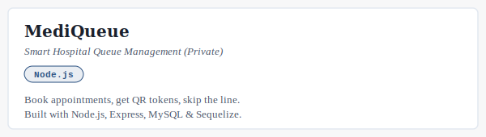
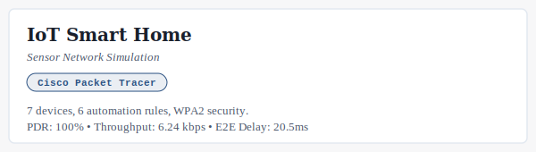
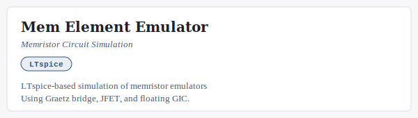
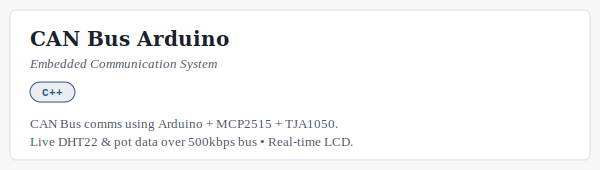
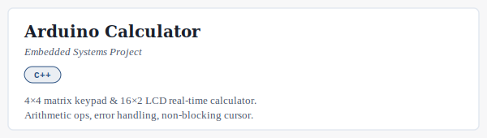
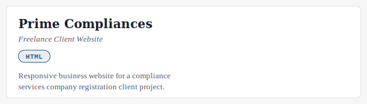
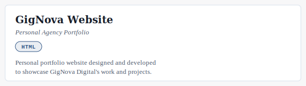
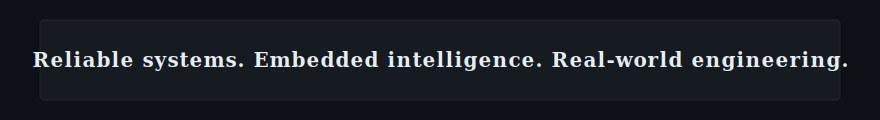

# Divyanshu Kumar
<picture>
  <source
    media="(prefers-color-scheme: dark)"
    srcset="./dark_mode.svg?v=2"
  />
  <source
    media="(prefers-color-scheme: light)"
    srcset="./light_mode.svg?v=2"
  />
  
</picture>

⸻

## ✦ About Me

<picture>
  <source media="(prefers-color-scheme: dark)" srcset="./assets/about_dark.svg?v=2">
  <source media="(prefers-color-scheme: light)" srcset="./assets/about_light.svg?v=2">
  
</picture>

⸻

## ✦ Engineering Profile

<picture>
  <source media="(prefers-color-scheme: dark)" srcset="./assets/cards/engineering_profile_dark.svg?v=2">
  <source media="(prefers-color-scheme: light)" srcset="./assets/cards/engineering_profile_light.svg?v=2">
  
</picture>

 

⸻

## ✦ What I Build

<picture>
  <source media="(prefers-color-scheme: dark)" srcset="./assets/cards/what_i_build_dark.svg?v=2">
  <source media="(prefers-color-scheme: light)" srcset="./assets/cards/what_i_build_light.svg?v=2">
  
</picture>

 

⸻

## ✦ Technical Domains

<picture>
  <source media="(prefers-color-scheme: dark)" srcset="./assets/cards/technical_domains_dark.svg?v=2">
  <source media="(prefers-color-scheme: light)" srcset="./assets/cards/technical_domains_light.svg?v=2">
  
</picture>

 

⸻

## ✦ Tech Stack

<picture>
  <source media="(prefers-color-scheme: dark)" srcset="./assets/cards/tech_stack_dark.svg?v=2">
  <source media="(prefers-color-scheme: light)" srcset="./assets/cards/tech_stack_light.svg?v=2">
  
</picture>

⸻

## ✦ Selected Engineering Projects

<!-- STARRED_REPOS_START -->
## ✦ Featured Projects
<table>
<tr>
<td width="50%" valign="top">
<a href="https://github.com/Divyanshukumar2005/MediQueue-Hospital-Management-System">
<picture>
  <source media="(prefers-color-scheme: dark)" srcset="./assets/projects/project-mediqueue-hospital-management-system-dark.svg">
  <source media="(prefers-color-scheme: light)" srcset="./assets/projects/project-mediqueue-hospital-management-system-light.svg">
  
</picture>
</a>
</td>
<td width="50%" valign="top">
<a href="https://github.com/Divyanshukumar2005/Mediqueue">
<picture>
  <source media="(prefers-color-scheme: dark)" srcset="./assets/projects/project-mediqueue-dark.svg">
  <source media="(prefers-color-scheme: light)" srcset="./assets/projects/project-mediqueue-light.svg">
  
</picture>
</a>
</td>
</tr>
<tr>
<td width="50%" valign="top">
<a href="https://github.com/Divyanshukumar2005/IoT-Smart-Home-Sensor-Network">
<picture>
  <source media="(prefers-color-scheme: dark)" srcset="./assets/projects/project-iot-smart-home-sensor-network-dark.svg">
  <source media="(prefers-color-scheme: light)" srcset="./assets/projects/project-iot-smart-home-sensor-network-light.svg">
  
</picture>
</a>
</td>
<td width="50%" valign="top">
<a href="https://github.com/Divyanshukumar2005/Mem_Element_Emulator">
<picture>
  <source media="(prefers-color-scheme: dark)" srcset="./assets/projects/project-mem-element-emulator-dark.svg">
  <source media="(prefers-color-scheme: light)" srcset="./assets/projects/project-mem-element-emulator-light.svg">
  
</picture>
</a>
</td>
</tr>
<tr>
<td width="50%" valign="top">
<a href="https://github.com/Divyanshukumar2005/CAN-Bus-Arduino">
<picture>
  <source media="(prefers-color-scheme: dark)" srcset="./assets/projects/project-can-bus-arduino-dark.svg">
  <source media="(prefers-color-scheme: light)" srcset="./assets/projects/project-can-bus-arduino-light.svg">
  
</picture>
</a>
</td>
<td width="50%" valign="top">
<a href="https://github.com/Divyanshukumar2005/Arduino-Calculator">
<picture>
  <source media="(prefers-color-scheme: dark)" srcset="./assets/projects/project-arduino-calculator-dark.svg">
  <source media="(prefers-color-scheme: light)" srcset="./assets/projects/project-arduino-calculator-light.svg">
  
</picture>
</a>
</td>
</tr>
<tr>
<td width="50%" valign="top">
<a href="https://github.com/Divyanshukumar2005/Prime-Compliances-Website">
<picture>
  <source media="(prefers-color-scheme: dark)" srcset="./assets/projects/project-prime-compliances-website-dark.svg">
  <source media="(prefers-color-scheme: light)" srcset="./assets/projects/project-prime-compliances-website-light.svg">
  
</picture>
</a>
</td>
<td width="50%" valign="top">
<a href="https://github.com/Divyanshukumar2005/GigNova-Website">
<picture>
  <source media="(prefers-color-scheme: dark)" srcset="./assets/projects/project-gignova-website-dark.svg">
  <source media="(prefers-color-scheme: light)" srcset="./assets/projects/project-gignova-website-light.svg">
  
</picture>
</a>
</td>
</tr>
</table>
<!-- STARRED_REPOS_END -->

⸻

## ✦ Current Engineering Direction

<picture>
  <source media="(prefers-color-scheme: dark)" srcset="./assets/cards/engineering_direction_dark.svg?v=2">
  <source media="(prefers-color-scheme: light)" srcset="./assets/cards/engineering_direction_light.svg?v=2">
  
</picture>

⸻

## ✦ GitHub Analytics

  

  

  

⸻

## ✦ Engineering Philosophy

<picture>
  <source media="(prefers-color-scheme: dark)" srcset="./assets/cards/engineering_philosophy_dark.svg?v=2">
  <source media="(prefers-color-scheme: light)" srcset="./assets/cards/engineering_philosophy_light.svg?v=2">
  
</picture>

 

⸻

## ✦ Founder & Builder

<a href="https://gignova.netlify.app/" target="_blank">
<picture>
  <source media="(prefers-color-scheme: dark)" srcset="./assets/cards/gignova_dark.svg?v=2">
  <source media="(prefers-color-scheme: light)" srcset="./assets/cards/gignova_light.svg?v=2">
  
</picture>
</a>

 

⸻

## ✦ Academic Journey

<picture>
  <source media="(prefers-color-scheme: dark)" srcset="./assets/cards/academic_journey_dark.svg?v=2">
  <source media="(prefers-color-scheme: light)" srcset="./assets/cards/academic_journey_light.svg?v=2">
  
</picture>

 

⸻

## ✦ Open To

<picture>
  <source media="(prefers-color-scheme: dark)" srcset="./assets/cards/open_to_dark.svg?v=2">
  <source media="(prefers-color-scheme: light)" srcset="./assets/cards/open_to_light.svg?v=2">
  
</picture>

 

⸻

## ✦ Connect

<picture>
  <source media="(prefers-color-scheme: dark)" srcset="./assets/cards/connect_dark.svg?v=2">
  <source media="(prefers-color-scheme: light)" srcset="./assets/cards/connect_light.svg?v=2">
  
</picture>
  

  
  
  

 

⸻

<picture>
  <source media="(prefers-color-scheme: dark)" srcset="./assets/cards/footer_dark.svg">
  <source media="(prefers-color-scheme: light)" srcset="./assets/cards/footer_light.svg">
  
</picture>

